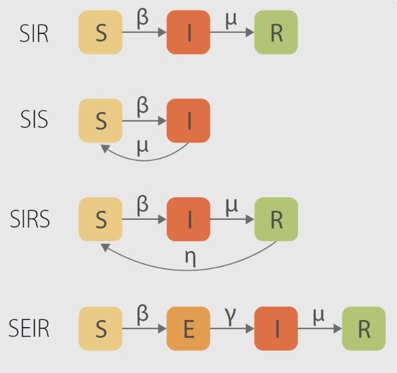

## The SEIR dynamic network epidemic models for individual risk prediction

During hackathon days our team brain-stormed a new algorithm RiskPropNet that models how infection risks propagate through the contact network. Our “risk-propagation” algorithm combines SEIR (susceptible-exposed-infected-removed) epidemic models (FIG.1) and machine learning approaches in order to predict the probability of infection for individual users. The algorithm processes in real-time a sequence of records of two types: the state data from the user, and the contact data from the pair of users.

When the user changes his or her state in the app, the RiskPropNet updates the probabilities of infection for all users who have contacted him or her in the recent past. This update spawns a fading wave of probability updates that propagates throughout the contact graph. Also RiskPropNet updates the parameters of two predictive models: the pair transmission model and the user infection model. All the above updates may require intensive computations from the backend side.

When the contact record comes, RiskPropNet updates the current risk estimates for both contacted users.

To the best of our knowledge, the individual-based epidemic models with learnable parameters for a dynamically changed network have not previously been proposed in the literature.
Our model is fully compatible with the data structure of the ContactTracer application.

FIG. 1 Diagrammatic representation of epidemic models in terms of reaction-diffusion processes. Boxes stand for different user states (compartments), while the arrows represent transitions between compartments, happening stochastically according to their respective rates [1].

### References

[1]   Romualdo Pastor-Satorras, Claudio Castellano, Piet Van Mieghem, and Alessandro Vespignani. Epidemic processes in complex networks. 2014.

[2]   Shi Pengpeng, Cao Shengli, and Feng Peihua.  SEIR transmission dynamics model of 2019 nCoV coronavirus with considering the weak infectious ability and changes in latency duration. 2020.

